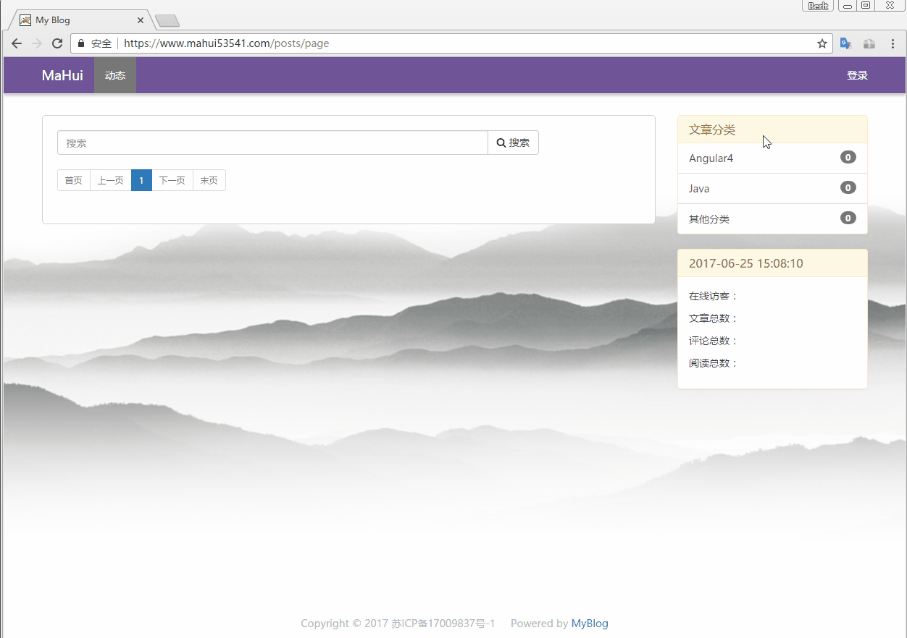
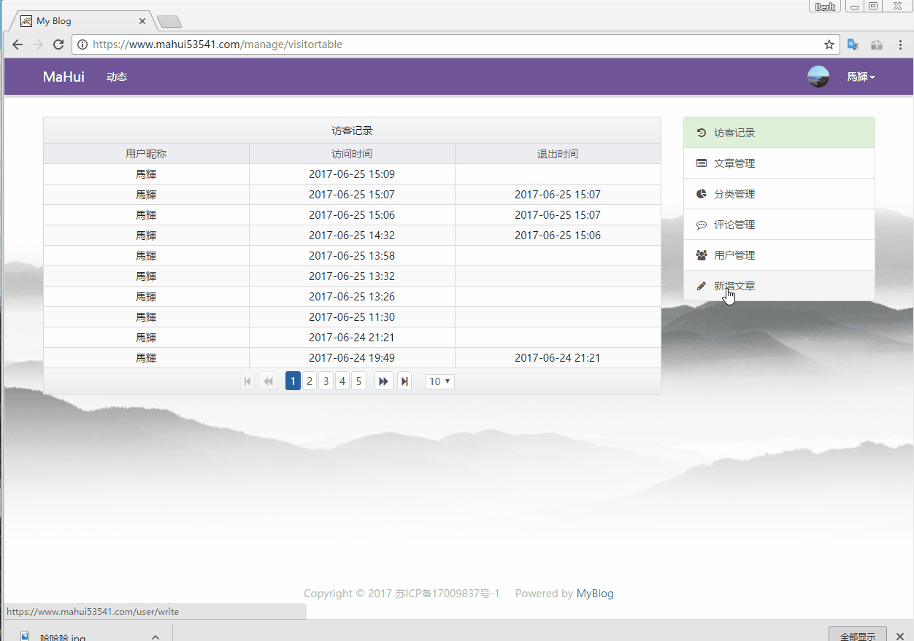

# MaHuiBlog
这是一个微型博客系统

- 前端基于Angular 6 + ngx-bootstrap(angular4文件夹下,不要在意这些命名)

- 后端(在javaweb夹下)采用SSM框架，数据库使用MySql，权限控制使用shiro，加入QQ第三方登录

# IDE

IntelliJ IDEA(不要问为什么，用了你就知道，如果是学生可以根据学生证免费使用，没有的话你懂得)

## 项目说明

首先说明这是一个Gradle项目，没有使用maven（纯属个人喜好，勿喷），本想用**通用Mapper3**或**MyBatis-plus**,但想了想还是算了，多锻炼一下。

## 使用方法

- 第一步：当然是克隆此项目的代码。

- 第二步：在IDEA中导入此项目并配置好Tomcat(具体就不贴图了)

- 第三步：新建本地数据库，数据库备份文件（Navicat）在javaweb/db目录下。

- 第四步：环境配置（具体参照：https://github.com/angular/angular-cli）

    全局安装angular-cli

    `npm install -g @angular/cli`

    进入angular4目录下，安装依赖

    `npm install`
    
    然后打包
    
    `ng build`

- 第五步：配置并启动nginx，把nginx的静态资源目录指向纯前端项目angular4下的dist目录

- 第六步：将javaweb/src/main/resources下的qqconnectconfig.properties配置文件填写自己申请的key

- 第七步：运行项目，浏览器访问http://localhost。

## 效果演示

实际效果演示：https://www.mahui53541.com

## 开源许可证
 MIT

